# Kodez CheckMate — AI-Powered SecOps Orchestration for Auth0

Kodez CheckMate is an AI-powered SecOps orchestration platform that takes [Auth0 CheckMate](https://auth0.com/blog/introducing-checkmate-for-auth0/) security scans from raw results to tracked, documented, and actioned findings — driven entirely by natural language prompts.

Security operations teams face a familiar problem. Vulnerability scanners surface findings. Those findings get copied into spreadsheets, pasted into tickets, summarised in emails, and posted in Slack channels — by hand, one step at a time. Kodez CheckMate closes that gap.

---

## What Is Auth0 CheckMate?

[Auth0 CheckMate](https://auth0.com/blog/introducing-checkmate-for-auth0/) is a security scanning tool built specifically for Auth0 tenants. It inspects your Auth0 configuration and surfaces vulnerabilities, misconfigurations, and compliance risks across your identity infrastructure.

Kodez CheckMate wraps that scanner in an AI orchestration layer — so the findings don't stop at a report. They flow automatically into your existing tools.

---

## Key Features

- **Prompt-Driven Scanning** — trigger Auth0 CheckMate scans with a single natural language prompt
- **AI Agent (GPT-5.4 on Azure)** — the primary interface; understands intent, confirms with you, then executes
- **Human-in-the-Loop Approval** — every action requires explicit user sign-off before running
- **Multi-Task Chaining** — combine multiple actions into one prompt; the agent parses, approves, and executes each in sequence
- **JIRA Integration** — create structured remediation tickets for every open vulnerability automatically
- **Confluence Integration** — publish executive summaries of scan results directly to a Confluence page
- **Microsoft Teams Alerts** — push vulnerability alerts to channels for immediate team notification
- **Vulnerability Dashboard** — compare scans over time and track risk trends with charts and graphs
- **Prompt Templates** — pre-built templates in the agent chat for common tasks
- **Enhanced PDF Reports** — export structured reports with severity breakdowns, remediation guidance, and scan comparisons
- **Auth0 Token Vault** — all connector credentials are stored securely in Auth0 Token Vault; tokens are never exposed in transit

---

## Live Links

| | |
|---|---|
| **Live Demo** | https://authorizedtoact.kodez.au/ |
| **Blog** | https://authorizedtoact.kodez.au/blog.html |
| **Product Slide Deck** | https://authorizedtoact.kodez.au/learn-more.html |
| **Developer Guide** | https://authorizedtoact.kodez.au/developer.html |

---

## Kodez CheckMate Architecture



---

## Prerequisites

- Node.js 18+
- PostgreSQL database
- Auth0 tenant with Token Vault enabled
- Azure OpenAI resource (GPT-5.4 / compatible deployment)

> For detailed setup instructions, follow all steps in the [Developer Guide](https://authorizedtoact.kodez.au/developer.html) before proceeding.

---

## Running the Application

```bash
# 1. Install dependencies
npm install

# 2. Configure environment
cp .env.example .env
# Edit .env and fill in all values (see Environment Variables below)

# 3. Build the Docker image
docker-compose build

# 4. Start the application
docker-compose up -d
```

The app runs on `http://localhost:3005` by default (controlled by `AUTH0_BASE_URL`).

The startup log prints the exact callback URLs that must be registered in Auth0 before connecting integrations.

---

## Auth0 Dashboard Setup

### Allowed Callback URLs

Register all of the following in **Auth0 Dashboard → Applications → your app → Settings → Allowed Callback URLs**:

```
http://localhost:3005/callback
http://localhost:3005/connect/github/complete
http://localhost:3005/connect/jira/complete
http://localhost:3005/connect/integrations/confluence/complete
http://localhost:3005/connect/integrations/teams/complete
```

### Full Configuration Checklist

| # | Setting | Where |
|---|---|---|
| 1 | Custom API: **Allow Offline Access** ON | Applications → APIs → your API → Settings |
| 2 | App: Grant Types → **Authorization Code**, **Refresh Token**, **Token Vault** | App → Advanced Settings → Grant Types |
| 3 | App: **Refresh Token Rotation OFF** | App → Advanced Settings → OAuth |
| 4 | App: **Allowed Callback URLs** — add all URLs above | App → Settings |
| 5 | App: **Multi-Resource Refresh Token → My Account API → ON** | App → Multi-Resource Refresh Token |
| 6 | My Account API: **Activate** | Applications → APIs → Auth0 My Account API |
| 7 | My Account API: App Access → your app → **Authorized**, all scopes | My Account API → Application Access tab |
| 8 | My Account API: **Allow Skipping User Consent** | My Account API → Settings → Access Settings |
| 9 | GitHub connection: Purpose → **Connected Accounts for Token Vault** + **Offline Access** | Authentication → Social → GitHub |
| 10 | GitHub connection: Applications → enable for your app | GitHub connection → Applications tab |
| 11 | Atlassian/JIRA connection: Purpose → **Connected Accounts for Token Vault** + **Offline Access** | Authentication → Social/Enterprise → Atlassian |
| 12 | Atlassian/JIRA connection: Applications → enable for your app | Atlassian connection → Applications tab |

---

## Environment Variables

| Variable | Description |
|---|---|
| `AUTH0_DOMAIN` | e.g. `dev-abc.au.auth0.com` |
| `AUTH0_CLIENT_ID` | Regular Web App client ID |
| `AUTH0_CLIENT_SECRET` | Regular Web App client secret |
| `AUTH0_BASE_URL` | `http://localhost:3005` — must match registered callback URLs |
| `AUTH0_AUDIENCE` | Custom API identifier |
| `AUTH0_MY_ACCOUNT_AUDIENCE` | `https://YOUR_TENANT.auth0.com/me/` (trailing slash required) |
| `AUTH0_GITHUB_CONNECTION` | Usually `github` |
| `AUTH0_JIRA_CONNECTION` | Auth0 connection name for Atlassian/JIRA. Defaults to `atlassian` |
| `AUTH0_JIRA_SCOPES` | Optional override for JIRA scopes |
| `AUTH0_CONFLUENCE_CONNECTION` | Auth0 connection name for Confluence |
| `AUTH0_CONFLUENCE_SCOPES` | Optional Confluence scopes for Connected Accounts |
| `CONFLUENCE_SITE_URL` | Confluence site URL used to resolve the cloud resource |
| `CONFLUENCE_SPACE_ID` | Optional default Confluence space ID for quick publishing |
| `AUTH0_TEAMS_CONNECTION` | Auth0 connection name for Microsoft Teams |
| `AUTH0_TEAMS_SCOPES` | Optional Graph scopes for listing teams/channels and posting messages |
| `TEAMS_DEFAULT_TEAM_ID` | Optional default Microsoft Teams team ID |
| `TEAMS_DEFAULT_CHANNEL_ID` | Optional default Microsoft Teams channel ID |
| `GITHUB_REPO_OWNER` | GitHub username or org |
| `GITHUB_REPO_NAME` | Repository name |
| `GITHUB_WORKFLOW_ID` | e.g. `auth0-checkmate.yml` |
| `SESSION_SECRET` | Long random string for session signing |

---

## Tech Stack

- **Backend** — Node.js, Express
- **Authentication** — Auth0 (`express-openid-connect`)
- **Token Storage** — Auth0 Token Vault (Connected Accounts)
- **Database** — PostgreSQL (`pg`)
- **AI** — Azure OpenAI (GPT-5.4)
- **Integrations** — GitHub, Atlassian JIRA, Atlassian Confluence, Microsoft Teams (via Microsoft Graph API)

---

> Built for the [Authorized to Act: Auth0 for AI Agents](https://authorizedtoact.devpost.com/) hackathon by [Kodez](https://www.kodez.com.au/).
